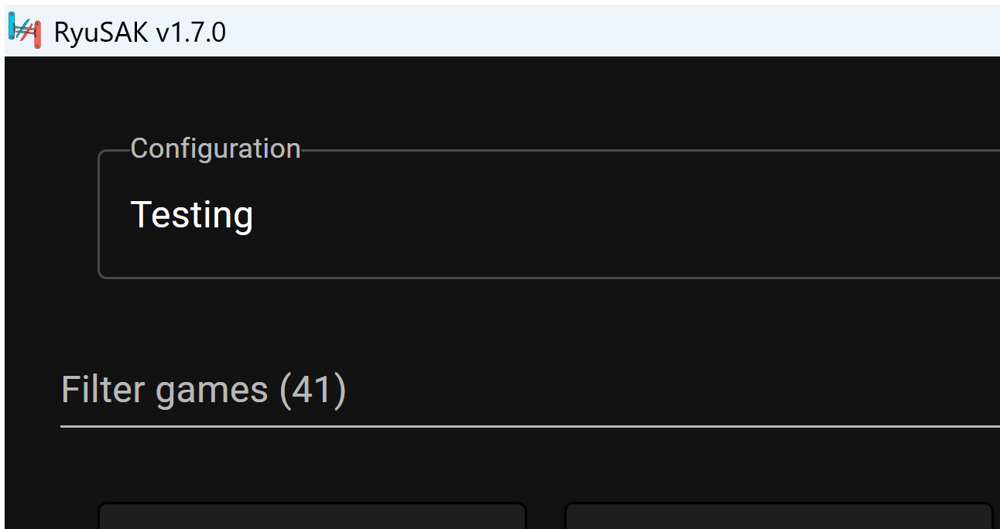

# RyuSAK 1.7.0 Community Build

  

This is a community-maintained fork of the original [Ecks1337/RyuSAK](https://github.com/Ecks1337/RyuSAK) project.

## Installation
Download `RyuSAK-1.7.0-Setup.exe` from the [v1.7.0 release](https://github.com/Casual-Gamer8001/RyuSAK/releases/tag/v1.7.0). The setup wizard asks whether you want a standard install or a portable install before you choose the install folder.

### Windows

#### Standard install
Choose **Standard install** in setup to store RyuSAK settings in your Windows user profile.

#### Portable
Choose **Portable install** in setup to create the `portable` marker and keep settings in an `electron_cache` folder next to `RyuSAK.exe`.

## Features
* Add one or multiple Ryujinx/Ryubing data folders to manage different emulator installs
* List your game library
* Display your local shaders count & RyuSAK shaders count (to download them if you have fewer shaders)
* Download and share shader caches through the Azure shader backend
* Use Azure title metadata and cover fallback
* Search SteamGridDB covers with your own API key
* Set custom game titles and covers
* Hide games from the RyuSAK library
* Show Ryubing compatibility data from the cached compatibility CSV
* Download saves for a specific game
* Download shaders for a specific game
* Downloads mods for a specific game

Product keys and firmware download/install functionality have been removed from this community build.

## Contributing
Requirements:
* Node.js
* Git

Install dependencies: `npm install --include=dev`

Run local build: `npm start`

Package a Windows build: `npm run build`

## Credits
* Ecks1337 and contributors for the original RyuSAK project
* CapitaineJSparrow for creating the original [emusak-ui](https://github.com/CapitaineJSparrow/emusak-ui) project
